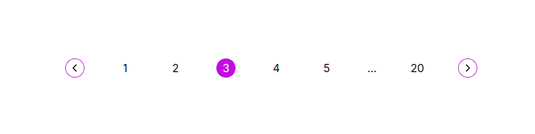

# Pagination Component

The `Pagination` component:

- A series of related content exists across multiple pages
- Represent by a list with left and right arrows which handle the previous and next sections the user makes
- Between the arrows, we map over the the `paginationRange` and render the page numbers as `pagination-indexes`.

  
