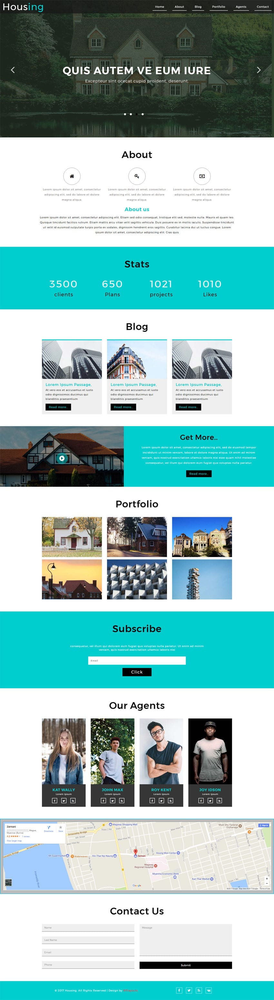

# Housing

Housing is a real estate-themed multipurpose template, a smart choice for all your real estate websites in order to expand your business around the world and boost your profits by using this modern and creatively designed template. This smartly designed template is also a perfect choice for all your websites like real estate agents, brokerages, apartment managers, residential & commercial developers, vacation rentals, companies, property, realtors, corporate, and much more. This creatively designed template has pretty awesome features like banner slider, smooth scrolling navigation, progressive numbers, Vimeo video player, image lightbox effect, and a clean, sleek, minimalistic, and elegant style of design in every detail. This magnificently designed template is built in HTML5, CSS3, and JQuery.

**Template Name**: Housing a Real Estate Web

**Compatible Browsers**: Google Chrome, Firefox, Safari, IE 10 etc.

&copy; [w3layouts](https://w3layouts.com/template/housing-a-real-estate-category-bootstrap-responsive-web-template/)

Happy Coding :))
