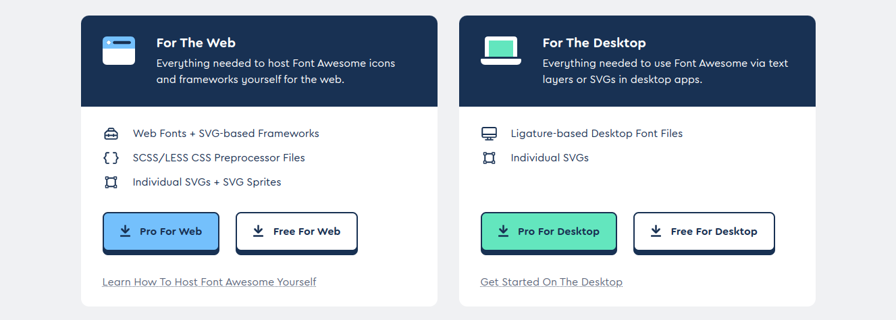
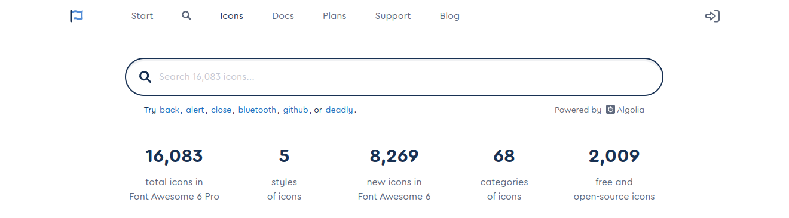
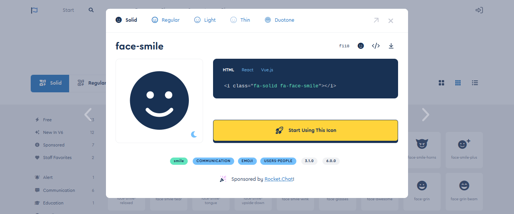

# **Font Awesome**

**Font Awesome** is the Internet's icon library and toolkit, used by millions of designers, developers, and content creators.

&nbsp;

## **Set Up** (Host Yourself - Web Fonts)

**Download**

Make sure to download [the Font Awesome files](https://fontawesome.com/download).

For The Web: everything needed to host Font Awesome icons and frameworks yourself for the web.

For The Desktop: everything need to use Font Awesome via text layers or SVGs in desktop apps.



**Add Font Awesome Files to the project**

Copy the `/webfonts` folder and `/css/all.css` file into the project.

**Include Font Awesome in the project**

Add a link to the `all.css` file into the `<head>` of each template or page where you want to use Font Awesome.

```html
<head>
  <link rel="stylesheet" href="the-path-to-fontawesome/css/all.css" />
</head>
```

&nbsp;

## **How To Add Icons**

Browse the [Font Awesome Icons](https://fontawesome.com/icons) to find the icon you want on the web page.





Copy the class name and then paste it into the `<span>` element.

```html
<body>
  <span class="fa-solid fa-face-smile"></span>
</body>
```

Font Awesome recommends using `<i>` element with the Font Awesome CSS classes for the style class for the style of the icon instead of `<span>`.

```html
<body>
  <i class="fa-solid fa-face-smile"></i>
</body>
```
